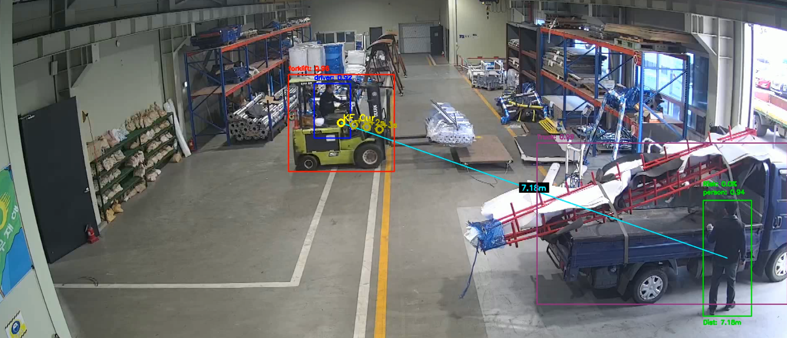
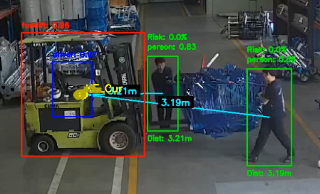
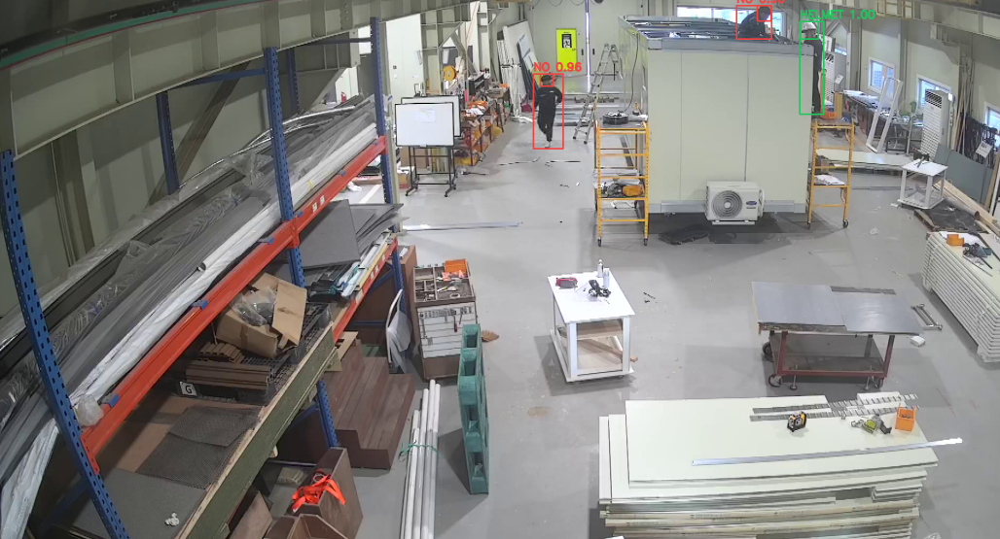
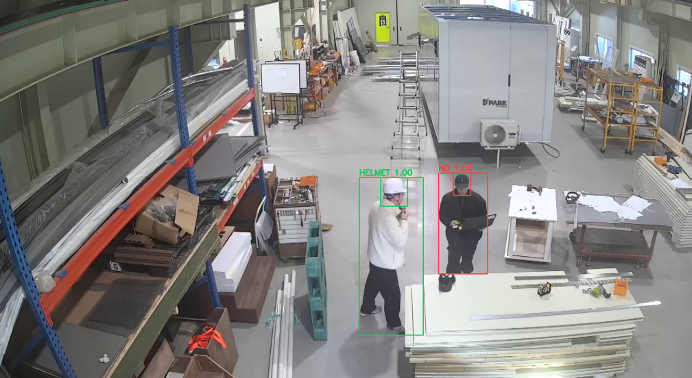
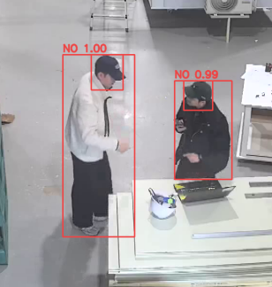

# EHS Watch 직접 학습 모델 공개 증빙

본 저장소는 GPU 임대 지원사업 수행 결과로 학습한 EHS Watch 안전 모니터링 모델 가중치를 공개하기 위한 증빙 자료입니다. 공개 대상은 실제 시스템 개발 과정에서 추가학습한 3개 객체탐지 모델이며, 모델 파일과 추론 예시 이미지를 함께 제공합니다.

## 1. 개요

EHS Watch는 산업 현장의 안전 위험을 영상 기반으로 감지하기 위한 모니터링 시스템입니다. 본 공개 자료는 다음 3개 위험 인식 기능에 사용되는 직접 학습 모델을 정리합니다.

- 지게차 탐지 모델: 작업장 내 `forklift`, `person`, `Truck` 객체 탐지
- 머리 탐지 모델: 사람 bbox 내부의 `head` 영역 탐지
- 헬멧 탐지 모델: `helmet`, `no_helmet` 객체 직접 탐지

본 문서의 목적은 단순 사용 설명이 아니라, GPU 임대 지원사업을 통해 생성된 학습 산출물이 실제 시스템에 적용되었고 GitHub에 공개 가능한 형태로 정리되었음을 증빙하는 것입니다.

## 2. 공개 모델 구성

| 구분             | 공개 파일                                                   | Task   | 클래스                        | 기반 모델    | 크기      |
| ---------------- | ----------------------------------------------------------- | ------ | ----------------------------- | ------------ | --------- |
| 지게차 탐지 모델 | `models/forklift_detection/ehs_watch_forklift_detection.pt` | detect | `Truck`, `forklift`, `person` | `yolo11x.pt` | 109.07 MB |
| 머리 탐지 모델   | `models/head_detection/ehs_watch_head_detection.pt`         | detect | `head`                        | `yolov8n.pt` | 5.51 MB   |
| 헬멧 탐지 모델   | `models/helmet_detection/ehs_watch_helmet_detection.pt`     | detect | `helmet`, `no_helmet`         | `yolov8m.pt` | 49.79 MB  |

실제 학습 데이터 원본은 개인정보와 현장 보안 이슈가 있을 수 있어 공개 대상에서 제외하고, 학습 결과물인 모델 가중치와 추론 예시 이미지를 공개합니다.

## 3. 모델 공개 목적

- GPU 임대 지원사업으로 수행한 추가학습 결과물 공개
- 직접 학습한 모델의 task, class, 기반 모델, 적용 목적 명시
- 실제 앱에서 bbox가 표시되는 추론 결과 이미지 제공
- 모델 가중치와 문서를 GitHub에서 확인 가능한 형태로 정리
- 후속 검증자가 모델 파일 구조와 사용 방법을 이해할 수 있도록 설명 제공

## 4. 모델별 상세 설명

### 4.1 지게차 탐지 모델

- 파일: `models/forklift_detection/ehs_watch_forklift_detection.pt`
- 기반 모델: `yolo11x.pt`
- 학습 방식: Ultralytics YOLO 계열 detection 모델을 산업 현장 지게차 데이터셋으로 추가학습
- 클래스: `Truck`, `forklift`, `person`
- 주요 용도:
  - 작업장 내 지게차 bbox 탐지
  - 사람 bbox 탐지
  - 트럭 bbox 탐지
  - 사람과 지게차 간 거리 및 접근 위험 계산의 입력 제공

현재 EHS Watch 앱의 위험 이벤트 계산은 `person`과 `forklift` 조합을 중심으로 수행합니다.

### 4.2 머리 탐지 모델

- 파일: `models/head_detection/ehs_watch_head_detection.pt`
- 기반 모델: `yolov8n.pt`
- 학습 방식: 경량 YOLO detection 모델을 사람 머리 영역 탐지 데이터로 추가학습
- 클래스: `head`
- 주요 용도:
  - 사람 bbox 내부에서 머리 영역 탐지
  - 헬멧 판정 모델 입력 영역을 안정적으로 제한
  - 멀리 있는 작업자 또는 상반신 일부만 보이는 상황에서 헬멧 판정 영역 보정

머리 탐지 모델은 단독 알림 모델이라기보다 헬멧 판정 정확도를 높이기 위한 중간 단계 모델입니다.

### 4.3 헬멧 탐지 모델

- 파일: `models/helmet_detection/ehs_watch_helmet_detection.pt`
- 기반 모델: `yolov8m.pt`
- 학습 방식: YOLOv8m detection 모델을 헬멧 착용/미착용 데이터셋으로 추가학습
- 클래스: `helmet`, `no_helmet`
- 주요 용도:
  - 헬멧 착용 상태 bbox 탐지
  - 헬멧 미착용 상태 bbox 탐지
  - 앱 화면에 `HELMET`, `NO` 또는 `no_helmet` 라벨 표시

현재 운영 앱에는 사람 탐지, 머리 탐지, 헬멧 판정이 결합된 flow가 존재합니다. 본 공개 모델은 그중 `helmet`과 `no_helmet`을 bbox로 직접 탐지하는 학습 결과물입니다.

## 5. 시스템 적용 흐름

### 5.1 지게차 위험 감지

```text
영상 프레임
→ 지게차 탐지 모델 추론
→ forklift/person/Truck bbox 생성
→ 사람-지게차 거리와 접근 방향 계산
→ warning 또는 danger 이벤트 판단
→ bbox, 거리, 위험도, 스냅샷 저장
```

### 5.2 헬멧 착용 감지

```text
영상 프레임
→ 사람 후보 탐지
→ 머리 탐지 모델로 head bbox 추출
→ 헬멧 탐지 모델 또는 헬멧 판정 모델 적용
→ helmet/no_helmet 결과 표시
→ 미착용 또는 불확실 상황 알림
```

본 공개 자료에서는 머리 탐지 모델과 헬멧 탐지 모델을 공개합니다.

## 6. 추론 예시 이미지

아래 이미지는 실제 앱 또는 검증 화면에서 모델이 bbox를 표시한 결과입니다. 공개 저장소에서는 이미지가 `assets/examples` 폴더에 포함됩니다.

### 6.1 지게차 탐지 예시 1



### 6.2 지게차 탐지 예시 2



### 6.3 헬멧 탐지 예시 1



### 6.4 헬멧 탐지 예시 2



### 6.5 헬멧 탐지 예시 3



## 7. 모델 사용 예시

### 7.1 지게차 탐지 모델

```python
from ultralytics import YOLO

model = YOLO("models/forklift_detection/ehs_watch_forklift_detection.pt")
results = model.predict(
    source="sample.jpg",
    imgsz=640,
    conf=0.25,
    iou=0.5,
)

print(results[0].boxes)
```

### 7.2 머리 탐지 모델

```python
from ultralytics import YOLO

model = YOLO("models/head_detection/ehs_watch_head_detection.pt")
results = model.predict(
    source="person_crop.jpg",
    imgsz=320,
    conf=0.4,
    iou=0.5,
)

print(results[0].boxes)
```

### 7.3 헬멧 탐지 모델

```python
from ultralytics import YOLO

model = YOLO("models/helmet_detection/ehs_watch_helmet_detection.pt")
results = model.predict(
    source="sample.jpg",
    imgsz=640,
    conf=0.35,
    iou=0.6,
)

print(results[0].boxes)
```

## 8. 공개 파일 구조

```text
ehs_watch_model/
├─ MODEL_RELEASE.md
├─ assets/
│  └─ examples/
│     ├─ forklift_detection_1.png
│     ├─ forklift_detection_2.png
│     ├─ helmet_detection_1.png
│     ├─ helmet_detection_2.png
│     └─ helmet_detection_3.png
└─ models/
   ├─ forklift_detection/
   │  └─ ehs_watch_forklift_detection.pt
   ├─ head_detection/
   │  └─ ehs_watch_head_detection.pt
   └─ helmet_detection/
      └─ ehs_watch_helmet_detection.pt
```
